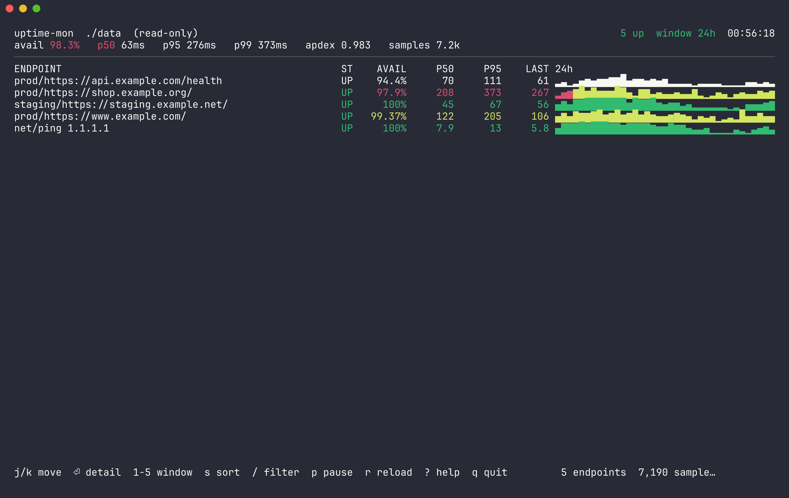
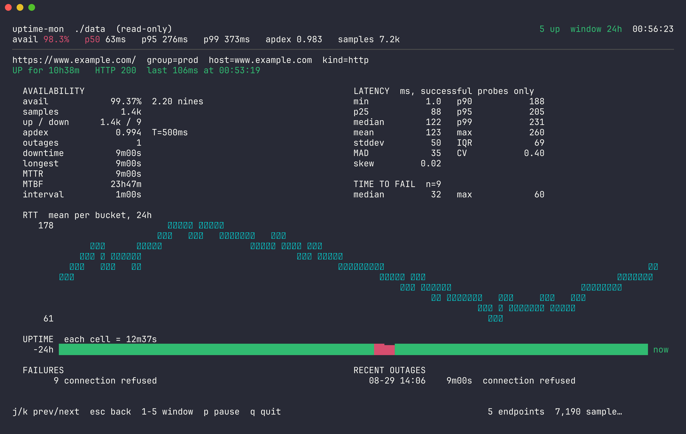

# uptime-mon

A small, single-binary uptime monitor. It fetches a list of URLs on a schedule,
appends every result to a plain-text file, compresses yesterday's file, and
gives you a terminal UI to read the history with real statistics in it.

That is the whole program. There is no web server, no database, no accounts, no
plugin system, and no alerting.

```
go install github.com/didvc/uptime-mon@latest
```



## Table of contents

| | |
| --- | --- |
| [Why this exists](#why-this-exists) | [The terminal UI](#the-terminal-ui) |
| [Install](#install) | [Reading the statistics](#reading-the-statistics) |
| [Quick start](#quick-start) | [The stats command](#the-stats-command) |
| [Coming from Uptime Kuma](#coming-from-uptime-kuma) | [Housekeeping](#housekeeping) |
| [The endpoints file](#the-endpoints-file) | [Command reference](#command-reference) |
| [Running the collector](#running-the-collector) | [Resource usage](#resource-usage) |
| [How your data is stored](#how-your-data-is-stored) | [Design notes](#design-notes) |
| [FAQ](#faq) | [Building from source](#building-from-source) |

## Why this exists

Most self-hosted uptime monitors are web applications. They ship a database, a
job queue, a REST API, a single-page front end, a login system, and integrations
for thirty notification services you will never enable. All of that is code that
can break, and most of it runs whether you use it or not. That is how a tool
whose actual job is sending an HTTP GET every sixty seconds ends up resident in
a hundred-plus megabytes of memory.

`uptime-mon` takes the opposite bet. It assumes you already have a terminal
open, that you do not need a dashboard strangers can visit, that you would
rather your monitoring data be a text file you can grep than rows in a database
only the application can read, and that you want to be told what happened when
you go looking rather than at three in the morning.

The result is one static binary of about 7 MB. It idles around 18 MB of resident
memory while watching sixty-odd endpoints, and stores a year of that history in
under a gigabyte.

The absence of alerting is a design decision. Alerting is the part of a monitor
that demands credentials, outbound network access, retry logic, deduplication,
escalation policies and a quiet-hours calendar. It is also the part that wakes
you for a blip that healed itself. If you want notifications, wire them up
yourself: `uptime-mon stats -format json` in a cron job, piped into whatever you
already use, is about four lines of shell and stays entirely under your control.

## Install

With Go 1.22 or newer:

```sh
go install github.com/didvc/uptime-mon@latest
```

Or grab a binary from the [releases page](https://github.com/didvc/uptime-mon/releases)
and drop it anywhere on your `PATH`.

There are two build dependencies. `github.com/klauspost/compress` provides zstd,
which the standard library does not. `golang.org/x/term` puts the terminal into
raw mode. Everything else, including the HTTP probing, the ICMP echo, the
statistics, the charts and the terminal rendering, is standard library.

## Quick start

Describe what to watch:

```sh
cp endpoints.example.txt endpoints.txt
$EDITOR endpoints.txt
```

Confirm it does what you meant, without writing anything to disk:

```sh
uptime-mon check
```

Start collecting. History lands in `./data` unless `-data` says otherwise:

```sh
uptime-mon run
```

Look at it later:

```sh
uptime-mon tui
uptime-mon stats -window 6h
```

To watch and browse in the same process, add `-tui` to the collector:

```sh
uptime-mon run -tui
```

That loads whatever history is already on disk, then keeps the display current
as new probes arrive.

## Coming from Uptime Kuma

Export your monitors from Uptime Kuma (Settings, then Backup, then Export) and
convert the JSON:

```sh
uptime-mon import -in Uptime_Kuma_Backup.json -out endpoints.txt
```

It reports what it did:

```
imported 91 monitor(s): http=64 keyword=22 ping=5
  63 enabled, 28 disabled
  groups: (none)=89 app=1 pages.dev=1
```

What survives the conversion: URLs, names, intervals, timeouts, retry counts,
accepted status codes, keyword checks including inverted ones, request headers,
HTTP basic auth, redirect limits, TLS-verification overrides, upside-down mode,
and tags, which become groups.

What does not survive: monitor types this tool has no opinion about, such as
DNS, Docker, MQTT, gRPC, Radius, Kafka and game-server queries. Each of those is
listed individually as skipped, with a reason. Nothing is silently dropped or
half-translated into something that looks like it works but does not.

| Flag | Effect |
| --- | --- |
| `-include-inactive` | also import paused monitors, written out as `enabled=false` |
| `-only http,keyword` | keep only the named Kuma types |
| `-group-from parent` | take the group from Kuma's monitor groups instead of tags |
| `-dry-run` | print the result to stdout without writing a file |

If you leave `-in` off, the importer looks for the newest `*.json` in
`.personal/` and then in the current directory.

Two things are adjusted rather than copied verbatim. Timeouts that would overlap
the next probe are pulled back to 90% of the interval, because Kuma is happy to
let a 48-second timeout sit inside a 20-second one and that just queues probes
behind each other. Duplicate names get a `#2` suffix, because Kuma allows two
monitors with the same name while here the name is the key your history is filed
under.

The generated file is re-read and re-parsed before it replaces anything, so a
conversion bug fails loudly instead of leaving you with a file that will not
load tomorrow.

## The endpoints file

`endpoints.txt` is the only configuration. One target per line:

```
defaults interval=60s timeout=10s expect=200-299

https://www.example.com/
https://api.example.com/health   name="API health" group=prod interval=30s
https://blog.example.com/        keyword="Welcome to my blog"
https://old.example.com/         expect=200-299,301
https://internal.example.lan/    insecure=true
https://retired.example.com/     enabled=false

ping://1.1.1.1                   name=cloudflare-dns group=net
tcp://db.example.internal:5432   name=postgres group=db timeout=3s
```

A `defaults` line sets the baseline for everything written below it, so a file
with ninety endpoints on the same schedule does not repeat `interval=60s` ninety
times. See [`endpoints.example.txt`](endpoints.example.txt) for the fully
annotated version and the complete option list.

There are four kinds of target. An `http://` or `https://` URL is fetched and
its status code checked. The same URL with a `keyword=` option is fetched, its
status code checked, and its body required to contain a phrase, or with
`invert=true`, required not to contain one. That second form catches the very
common case of a server cheerfully returning 200 alongside an error page.
`ping://host` sends an ICMP echo. `tcp://host:port` opens a TCP connection and
closes it. A bare hostname with no scheme is treated as `https://`.

### A note on ping

ICMP normally needs elevated privileges. On Linux, `uptime-mon` uses the
unprivileged ping socket instead, which works without root as long as your group
falls inside `net.ipv4.ping_group_range`:

```sh
# check
cat /proc/sys/net/ipv4/ping_group_range
# allow everyone (add to /etc/sysctl.d/ to persist)
sudo sysctl -w net.ipv4.ping_group_range="0 2147483647"
```

If that is unavailable, `uptime-mon` substitutes a TCP connect on port 443,
configurable with `-ping-fallback-port`, and prints one line at startup telling
you it did. Those samples are recorded with `kind=tcp` rather than `kind=ping`,
so your history never quietly changes meaning halfway through a day.

## Running the collector

```sh
uptime-mon run -endpoints endpoints.txt -data /var/lib/uptime-mon
```

Each endpoint gets its own schedule. First probes are staggered so that ninety
targets sharing a sixty-second interval do not all fire on the same second, and
a shared limit, `-concurrency`, capped at 8 by default, bounds how many requests
are in flight at once. Monitoring should be invisible to the things it monitors.

The collector is quiet by default. It prints a line only when an endpoint
changes state:

```
uptime-mon 1.0.0: watching 63 endpoint(s), writing to ./data, flushing every 10m0s
14:22:07 DOWN  503     2.3ms https://api.example.com/health  status 503 (want 200-299)
14:23:07 UP    200    41.9ms https://api.example.com/health
```

This is logging rather than alarming. Nothing is sent anywhere. Use `-v` to
print every probe, or `-quiet` for nothing but errors.

| Flag | Default | Effect |
| --- | --- | --- |
| `-endpoints` | `endpoints.txt` | which file to read |
| `-data` | `./data` | where to write history |
| `-tui` | off | show the live UI instead of log lines |
| `-once` | off | probe everything once, then exit |
| `-group` / `-endpoint` | — | watch only part of the file |
| `-interval` / `-timeout` | — | override every target at once |
| `-concurrency` | `8` | maximum probes in flight |
| `-resolver` | system | use a specific DNS server, such as `1.1.1.1:53` |
| `-no-keepalive` | off | open a fresh connection every probe |
| `-flush` | `10m` | how long results are batched before hitting disk |

### One-off checks

The `check` command probes everything once, prints a table with failures first,
writes nothing, and exits non-zero if anything is down. That makes it usable as
a smoke test in a script:

```sh
$ uptime-mon check
14:31:02 DOWN  502     2.2ms https://api.example.com/health  status 502 (want 200-299)
14:31:02 UP    200    41.9ms https://www.example.com/
14:31:02 UP           8.1ms  ping 1.1.1.1
uptime-mon check: 1 of 3 endpoint(s) down
```

## How your data is stored

One append-only text file per day, in
[InfluxDB line protocol](https://docs.influxdata.com/influxdb/latest/reference/syntax/line-protocol/):

```
data/
  uptime-2026-08-30.lp       today, open, plain text
  uptime-2026-08-29.lp.zst   yesterday, sealed with zstd
  uptime-2026-08-28.lp.zst
```

A single sample looks like this:

```
uptime,endpoint=https://www.example.com/,group=prod,host=www.example.com,kind=http up=1i,code=200i,rtt=41.912,dns=1.204,connect=8.310,tls=19.442,ttfb=39.100,bytes=18244i 1788017913861320544
```

Which is to say grep finds things in it and awk slices it, and anything that
speaks line protocol can read it. Pipe it straight into InfluxDB, Telegraf or
VictoriaMetrics if you ever want it somewhere else. There is no index, no
write-ahead log and no schema migration, because the only question anyone asks
of this data is what happened between two times, and scanning a day of text
answers that in a fraction of a second.

Recorded per probe: whether it was up, the HTTP status code, total round-trip
time, the DNS, TCP-connect, TLS-handshake and time-to-first-byte breakdown,
response size, attempt number, and on failure a short, stable error description.

### Batching

Results are held in memory and written every `-flush` interval, ten minutes by
default, rather than trickling out sample by sample. That keeps a monitor
running for months from becoming a steady drip of tiny writes. The trade-off is
explicit and yours to make: an unclean kill loses at most one flush interval.
Lower `-flush`, or add `-fsync`, if you would rather spend the I/O. A clean
shutdown via Ctrl-C or SIGTERM always flushes first.

### Compression

When a day ends, its file is compressed with zstd in the background and the
plain copy removed. The real-world ratio is roughly eightfold, or about 21 bytes
per sample. Concretely, 90 endpoints probed every 60 seconds is around 130,000
samples a day, 2.6 MB compressed, under 1 GB a year. If the process is killed
mid-day, the next start seals the leftover file before doing anything else.

Everything that reads the data handles compressed and plain files transparently,
and can do so while the collector is writing.

## The terminal UI

```sh
uptime-mon tui          # read-only, over recorded history
uptime-mon run -tui     # live, alongside the collector
```

The list view puts every endpoint's health on one screen: current state,
availability, median and 95th-percentile latency, the last measurement, and a
sparkline of latency across the window. Cells where probes failed are tinted, so
an endpoint that is fast and broken at the same time cannot hide behind a flat
green line.



Press <kbd>Enter</kbd> on any endpoint for the detail view: the full latency
distribution, outage structure, a braille line chart of round-trip time, a
colour-coded uptime strip, a breakdown of failure causes, and the most recent
outages with timestamps and durations.

| Key | Action |
| --- | --- |
| <kbd>j</kbd> <kbd>k</kbd> <kbd>↑</kbd> <kbd>↓</kbd> | move the selection |
| <kbd>g</kbd> <kbd>G</kbd> <kbd>Home</kbd> <kbd>End</kbd> | first / last endpoint |
| <kbd>PgUp</kbd> <kbd>PgDn</kbd> | move by ten |
| <kbd>Enter</kbd> <kbd>l</kbd> <kbd>→</kbd> | open the detail view |
| <kbd>Esc</kbd> <kbd>h</kbd> <kbd>←</kbd> | back to the list |
| <kbd>Tab</kbd> | toggle list and detail |
| <kbd>1</kbd>…<kbd>5</kbd> | window: 1h, 6h, 24h, 7d, 30d |
| <kbd>s</kbd> <kbd>S</kbd> | cycle the sort order |
| <kbd>/</kbd> | filter by name or group |
| <kbd>p</kbd> | pause recomputation |
| <kbd>r</kbd> | reload the window from disk |
| <kbd>?</kbd> | help, including a glossary of the statistics |
| <kbd>q</kbd> <kbd>Ctrl-C</kbd> | quit |

The UI restores your terminal on exit, including on SIGTERM, and respects
`NO_COLOR`.

The round-trip-time chart uses Unicode braille characters to get 2×4 resolution
out of every character cell. Essentially every modern monospace font has them.
If yours renders boxes, the rest of the interface still works.

## Reading the statistics

The point of the detail view is that the numbers are the ones you would actually
want, computed honestly.

Availability is the fraction of probes that succeeded. It is a sample-based
estimate rather than a time-weighted one; with an even interval the two agree,
and probe data has nothing better to offer. It is never rounded up, so 99.97%
displays as 99.97%, because claiming 100% is a stronger statement than observing
no failures. The nines figure restates the same number the way availability
targets are usually written, so 99.9% becomes 3.00 nines.

Latency percentiles cover successful probes only. This matters more than it
sounds. If a failing endpoint's ten-second timeouts joined the same population,
one bad afternoon would drag the median somewhere meaningless. How long a probe
takes to fail is genuinely interesting, since an instant connection-refused and
a slow timeout are different situations, so that gets reported separately under
the heading "time to fail".

Percentiles are exact, computed from every retained sample by linear
interpolation between order statistics, the definition `numpy.percentile` and
most spreadsheets use. Nothing is sketched or approximated.

Spread gets three numbers instead of one. Standard deviation is the familiar
one, and the one a single ten-second timeout distorts most. Median absolute
deviation is the median distance from the median; outliers barely move it, which
makes it the honest answer to how jittery an endpoint is on a normal day. The
coefficient of variation is standard deviation divided by mean, so it carries no
units and lets a 5 ms endpoint and a 500 ms endpoint be compared for stability
rather than speed. Alongside those sit the interquartile range, covering the
middle half of observations, and skew. Positive skew means a long right tail,
which is the normal shape for latency; a sudden move toward symmetry usually
means something is now slow all the time rather than occasionally.

Outages are runs of consecutive failures, each bounded by the recovering probe,
which is the conservative reading. From those come total downtime, the longest
single outage, mean time to recovery and mean time between failures.

Apdex compresses latency into one number against a target `T`, set by `-apdex`
and defaulting to 500 ms. Probes at or under `T` score 1, those under `4T` score
a half, and anything slower or failed scores zero. A result of 1.000 means
everything was fast; 0.500 means everything was merely tolerable.

Gaps count the stretches where the monitor itself was not running, detected as
intervals more than three times the median. Availability cannot see these, since
no probe means no recorded failure, so they are reported separately instead of
silently counting as uptime. If you restarted the collector, this is where it
shows up.

Interval is the median gap between samples, and therefore the effective
resolution of every number above it.

## The stats command

For scripts, cron jobs, and anything that is not a terminal.

```sh
uptime-mon stats -window 24h
uptime-mon stats -since 7d -sort p95 -top 10
uptime-mon stats -since 2026-08-01 -until 2026-08-08 -format detail
```

`-since` and `-until` accept a duration ago such as `24h` or `7d`, a date such
as `2026-08-29`, a full RFC 3339 timestamp, or `now`.

```
$ uptime-mon stats -window 24h
2026-08-29 00:41 .. 2026-08-30 00:41  (1d00h)
5 endpoints  7,195 samples  avail 98.31%  p50 63  p95 285  p99 386  apdex 0.983

ENDPOINT                        STATE     N    AVAIL      P50      P95      P99    OUT APDEX DOWNTIME
-----------------------------------------------------------------------------------------------------
https://api.example.com/health     up 1,439   94.44%       69      111      125      2 0.944    1h20m
https://shop.example.org/          up 1,439   97.91%      211      386      457      3 0.976   30m00s
https://www.example.com/           up 1,439   99.37%      122      206      239      1 0.994    9m00s
https://staging.example.net/       up 1,439     100%       45       68       75      0 1.000        -
```

| `-format` | For |
| --- | --- |
| `table` | the summary above, the default |
| `detail` | every statistic, per endpoint, as text |
| `json` | scripting; includes per-bucket series with `-buckets N` |
| `csv` | spreadsheets |
| `prom` | Prometheus text exposition, for a scrape job or Pushgateway |

Since there is no built-in alerting, the JSON output is how you build your own:

```sh
uptime-mon stats -window 15m -format json \
  | jq -r '.endpoints[] | select(.availability < 0.9) | .endpoint' \
  | while read -r ep; do notify-send "endpoint down: $ep"; done
```

## Housekeeping

```sh
uptime-mon data                      # list day files with sizes
uptime-mon data -count               # and count samples in each
uptime-mon data -compact             # compress any completed day still in plain text
uptime-mon data -prune 90            # delete files older than 90 days (asks first)
```

```
$ uptime-mon data -count
DAY          FORM         SIZE      SAMPLES
2026-08-28   zstd      2.6 MiB      129,600
2026-08-29   zstd      2.6 MiB      129,600
2026-08-30   plain    24.4 KiB          200

3 file(s), 5.2 MiB on disk, 259,400 samples, 21.0 bytes/sample
```

The collector does both compaction and retention on its own, the latter via
`-retention-days`. The `data` command exists for tidying up after an interrupted
run. Deleting recorded history cannot be undone, so `-prune` confirms before
acting unless you pass `-y`.

## Command reference

```
uptime-mon <command> [flags]

  run       probe endpoints and record results
  tui       browse recorded data in the terminal UI
  stats     print statistics for a time window
  check     probe every endpoint once and print the result
  import    convert an Uptime Kuma backup into endpoints.txt
  data      list, compact and prune the data directory
  version   print the version
```

Every command takes `-h` for its own fully documented flag list.

## Resource usage

Measured while watching 63 real endpoints at a 60-second interval:

| | |
| --- | --- |
| Binary size | ~7 MB, static, no runtime dependencies |
| Resident memory | ~18 MB |
| Threads | 14 |
| CPU, idle between probes | negligible |
| Disk, 90 endpoints at 60s | ~2.6 MB/day compressed, ~940 MB/year |
| `stats` over a full day (130k samples, from zstd) | 0.19 s, 38 MB peak |

Memory is bounded by design. The live view keeps samples in a fixed-size ring
buffer of 24-byte records, with error strings interned per endpoint, so a
24-hour window over 90 endpoints costs about 3 MB. The ring is sized from the
window you actually asked for.

## Design notes

A few decisions are worth knowing about, because they were deliberate and you
may disagree with them.

Round-trip time is measured to the end of the response body, capped at 1 MiB,
instead of stopping at the first byte. A page that returns headers instantly and
then stalls is not a healthy page. Time-to-first-byte is recorded separately if
you want to separate server thinking time from bytes on the wire.

Connections are reused between probes by default, which keeps handshake load off
the endpoints you are watching. The consequence is that DNS, connect and TLS
timings are only recorded on the probe that actually opened the connection.
They are omitted rather than reported as zero, since reporting "0 ms DNS" would
suggest DNS was instant when in fact it never happened. Pass `-no-keepalive` to
turn reuse off.

Error messages are normalised to short, stable text such as `timeout`,
`connection refused`, `dns: no such host`, `tls: certificate verification
failed`, or `status 429 (want 200-299)`. Go's raw network errors embed the
address, which would make every failure look unique and destroy any useful
grouping.

Rotation is driven by the data rather than the wall clock. The first sample
stamped with a new day seals the previous file, and rotation only ever moves
forward, so a probe that starts at 23:59:59 and finishes after midnight cannot
reopen yesterday.

Compression writes to a temporary file and renames it, so an interrupted
compression never leaves a half-written `.zst` that a later read would treat as
real data. In the same spirit, a truncated final line is skipped rather than
being fatal: if the process was killed mid-write you lose that one sample rather
than the day.

## FAQ

**Can I run it as a service?**
Yes. It is a normal foreground process that handles SIGTERM cleanly. A minimal
systemd unit:

```ini
[Unit]
Description=uptime-mon
After=network-online.target

[Service]
ExecStart=/usr/local/bin/uptime-mon run -endpoints /etc/uptime-mon/endpoints.txt -data /var/lib/uptime-mon
Restart=always
DynamicUser=yes
StateDirectory=uptime-mon

[Install]
WantedBy=multi-user.target
```

**Can two copies write to the same data directory?**
Please don't. Use one collector per directory. Any number of readers can run
against it at the same time.

**Can I read the history while the collector is running?**
Yes. Both readers open the files read-only, and the read-only UI re-reads on a
timer so it stays current.

**What happens to buffered samples if I kill it?**
Ctrl-C and SIGTERM flush before exiting. SIGKILL or a power cut loses up to one
`-flush` interval.

**Why is my endpoint DOWN with a 200 status code?**
It has a `keyword=` option and the phrase is no longer in the page. That is
usually correct and useful, but sites do change their wording, so check the page
before blaming the monitor.

**Does it support IPv6, HTTP/2 and proxies?**
IPv6 and HTTP/2 yes, with `-no-http2` available to force 1.1. Proxies work via
the usual `HTTP_PROXY`, `HTTPS_PROXY` and `NO_PROXY` environment variables. ICMP
is IPv4 only; use a `tcp://` target for IPv6 reachability.

**Can I change the measurement name or add tags?**
Yes, with `-measurement` and with `-tag key=value`, which is repeatable and
stamps every sample. Useful when several machines write into one eventual store.

**Is the file format stable?**
Line protocol is an established format, and the tag and field names here are
part of the interface. Read it with whatever you like.

## Building from source

```sh
git clone https://github.com/didvc/uptime-mon
cd uptime-mon
go build -o uptime-mon .
go test ./...
```

Requires Go 1.22 or newer. The test suite is self-contained. It spins up local
HTTP servers and temporary directories, and touches the network only for an
optional ICMP capability check.

Repository layout:

```
main.go, cmd_*.go        command-line interface
internal/model           the shared types: what to probe, what came back
internal/endpoints       endpoints.txt parser and writer
internal/probe           HTTP, keyword, ICMP and TCP probing
internal/collect         scheduling and concurrency
internal/lineproto       line-protocol encoder and decoder
internal/store           daily files, batching, rotation, zstd, retention
internal/stats           availability, distributions, outages, bucketing
internal/series          the compact in-memory window the UI reads
internal/tui             terminal rendering and charts
internal/importer        Uptime Kuma conversion
```

## Licence

Mozilla Public License 2.0. See [LICENSE](LICENSE).

In short: use it anywhere, including in commercial and closed-source products.
If you modify one of these source files and distribute the result, share your
changes to that file under the same licence. Your own separate code is not
affected.
